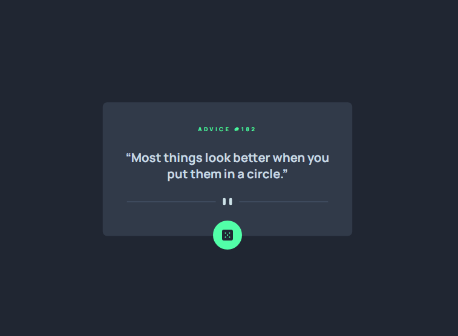

# Frontend Mentor - Advice generator app solution

This is a solution to the [Advice generator app challenge on Frontend Mentor](https://www.frontendmentor.io/challenges/advice-generator-app-QdUG-13db). Frontend Mentor challenges help you improve your coding skills by building realistic projects.

## Table of contents

- [Overview](#overview)
  - [About it](#About-it)
  - [Screenshot](#screenshot)
  - [Links](#links)
- [My process](#my-process)
  - [Built with](#built-with)
  - [What I learned](#what-i-learned)
  - [Continued development](#continued-development)
  - [Useful resources](#useful-resources)
- [Author](#author)
- [Acknowledgments](#acknowledgments)
## Overview

### About it

You can able to get any peice of random advice in one click 
- click on the dice button and wait for 2 second you'll get one

### Screenshot

### Links

- Solution URL: [Add solution URL here](https://github.com/Ofcl-Javed/freeAdvice)
- Live Site URL: [Add live site URL here](https://ofcl-javed.github.io/freeAdvice/)

## My process
I start with Semantic HTML5 and using CSS3 gridbox to style it for different devices. It's very helpful to learn promises and async await of modern javascript.

### Built with

- Semantic HTML5 markup
- CSS Grid
- DeskTop-first workflow
- Basic JavaScript

### What I learned

I have learn about promises and async await with the help of this project

### Continued development

I'm willing to learn more about api and work with them in backend and create my own api

## Author

- Website - [Javed](https://ofcl-javed.github.io/findjaved/)
- Frontend Mentor - [@Ofcl-Javed](https://www.frontendmentor.io/profile/Ofcl-Javed)